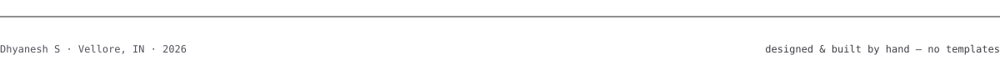

  <picture></picture>

 

  <a href="#projects">Projects</a>&nbsp;&nbsp;·&nbsp;&nbsp;
  <a href="#stack">Stack</a>&nbsp;&nbsp;·&nbsp;&nbsp;
  <a href="#interests">Interests</a>&nbsp;&nbsp;·&nbsp;&nbsp;
  <a href="#contact">Contact</a>

<picture></picture>

### Currently

<picture></picture>

<picture></picture>

<h3 id="projects">Selected projects</h3>

<table>
  <tr>
    <td width="50%">
      
    </td>
    <td width="50%">
      
    </td>
  </tr>
  <tr>
    <td width="50%">
      
    </td>
    <td width="50%">
      
    </td>
  </tr>
</table>

OTHER EXPERIMENTS

 
<table>
  <tr>
    <td width="50%" valign="top">
      <b>CodeMap</b> 
      Change impact analysis and architecture drift detection across repositories. Shares design lineage with Nous. 
      <a href="https://github.com/Dhyanesh2603/Codemap">github.com/Dhyanesh2603/Codemap</a>
    </td>
    <td width="50%" valign="top">
      <b>JustDeal</b> 
      AI-powered real estate investment advisor. ML models for price prediction, rental yield, and risk analysis. 
      <a href="https://github.com/Dhyanesh2603/JustDeal">github.com/Dhyanesh2603/JustDeal</a>
    </td>
  </tr>
</table>

<picture></picture>

<h3 id="stack">Technical stack</h3>

<picture></picture>

<picture></picture>

<h3 id="interests">Learning &amp; interests</h3>

<table>
  <tr>
    <td width="33%" valign="top">
      <b>Systems</b> 
      How real infrastructure stays up — consensus, storage engines, networking internals.
    </td>
    <td width="33%" valign="top">
      <b>AI Engineering</b> 
      Moving models from notebooks into reliable, observable production systems.
    </td>
    <td width="33%" valign="top">
      <b>Developer Tools</b> 
      Compilers, static analysis and the craft of tools engineers actually enjoy.
    </td>
  </tr>
</table>

<picture></picture>

<h3 id="contact">Contact</h3>

Open to **SDE, AI Engineering and Systems** internships and roles.

  &nbsp;&nbsp;
  &nbsp;&nbsp;
  

 

<picture></picture>
