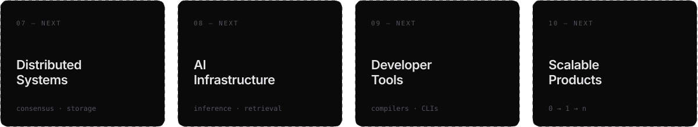

  

 

  <a href="#projects">Projects</a>&nbsp;&nbsp;·&nbsp;&nbsp;
  <a href="#stack">Stack</a>&nbsp;&nbsp;·&nbsp;&nbsp;
  <a href="#interests">Interests</a>&nbsp;&nbsp;·&nbsp;&nbsp;
  <a href="#contact">Contact</a>

### Currently

<h3 id="projects">Engineering projects</h3>

<table>
  <tr>
    <td width="50%">
      
    </td>
    <td width="50%">
      
    </td>
  </tr>
  <tr>
    <td width="50%">
      
    </td>
    <td width="50%">
      
    </td>
  </tr>
  <tr>
    <td width="50%">
      
    </td>
    <td width="50%">
      
    </td>
  </tr>
</table>

NEXT BUILDS

<h3 id="stack">Technical stack</h3>

<h3 id="interests">Learning &amp; interests</h3>

<table>
  <tr>
    <td width="33%" valign="top">
      <b>Systems</b> 
      How real infrastructure stays up — consensus, storage engines, networking internals.
    </td>
    <td width="33%" valign="top">
      <b>AI Engineering</b> 
      Moving models from notebooks into reliable, observable production systems.
    </td>
    <td width="33%" valign="top">
      <b>Developer Tools</b> 
      Compilers, static analysis and the craft of tools engineers actually enjoy.
    </td>
  </tr>
</table>

<h3 id="contact">Contact</h3>

Open to **SDE, AI Engineering and Systems** internships and roles.

<table>
  <tr>
    <td>EMAIL <a href="mailto:your.email@example.com">your.email@example.com</a></td>
    <td>LINKEDIN <a href="https://linkedin.com/in/your-handle">in/your-handle</a></td>
    <td>GITHUB <a href="https://github.com/Dhyanesh2603">@Dhyanesh2603</a></td>
  </tr>
</table>

 

